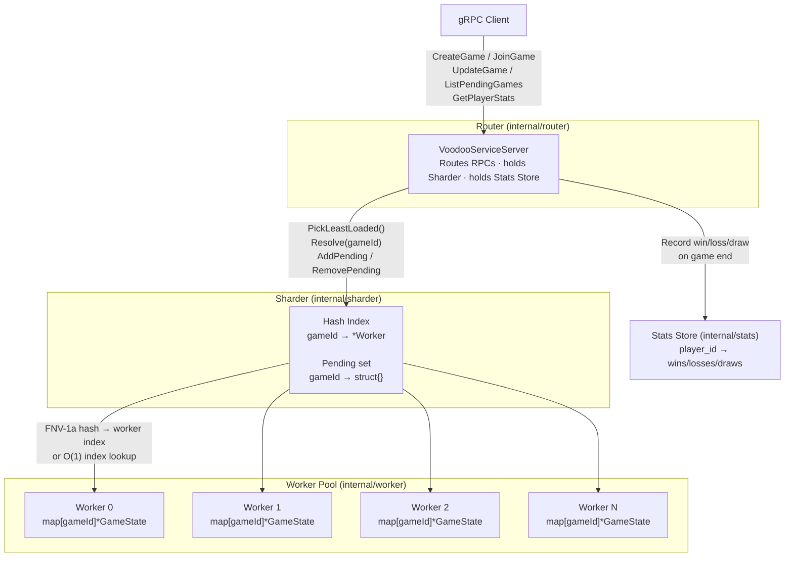

# Voodoo Tic-Tac-Toe case study - Thomas Gainant

## Requirements

Golang >= 1.25
Make

### Optional

grafana/k6 v2.2.0

## How to run

Run the server:
``make run``

Simulate a client (local, standalone app, decoupled from test environment):
``make client``

Tests:
``make test``

Unit tests:
``make test/unit``

Acceptance tests:
``make test/acceptance``

Load tests:
``make test/load``

## How it has been built

This is the code architecture which was decided:

The core technical challenge was identified to be the division of the workload between different workers to improve scalability, and having a O(1) access to these different shards.

The first solution coming for such a demo app was using an hash table, like in old database systems. Instead of having an index corresponding to the position offset in a segment file on which we could find a record, the hash table would include pointers to a worker.
This allows to have a registry directly in memory to route the requests directly to the correct workers handling a specific part of a shard (i.e. game state of an active game).

The game logic and all the rules are then handled inside the worker, enabling a fully authoritative game architecture.

The application has been built using AI (Copilot + Claude Sonnet 4.6) to speed up the process. Every single line of code has been reviewed before being accepted. An AGENTS.md file has been updated throughout the development of the application to help with further work on it.

## Tradeoffs

- Using the hash table technique has the obvious drawback of having the whole table of games in memory. That means that the memory will be used relative to the number of registered games
- That implies having to have a cleaning functionality checking which games are still active and finished or dumping the least used game states on disk and just keep the most used in memory (not yet implemented)

## What could be improved

- There is currently only an dynamic upscaling of workers. Their numbers will always grow higher. The Sharder needs to address that by removing Workers dynamically if they have no workload. One solution is also to switch to a horizontal scaling infrastructure solution like Kubernetes to add or remove nodes which runs a dedicated Worker.
- Having every game id on the hash table also could be improved by optimising index access with SST or B-Tree. The implies sorting of the game IDs would require some extra implementation regarding the maintaining of the hash table.
- The game logic should be seperated from the Worker structure, with its own structure. Currently, this is ugly from a gameplay development perspective.
- The router and sharder layers could probably be merged, if we wanted a cleaner code.
- Use of a channel per worker for communication to remove locks

## Important prompts history

Here is the list of the important prompts I used to accelerate the development:

### Base Golang application

> I am creating a Go server application. I need you to create the basics of it.

> That means having a way to run the app and run the tests for it.

> I want to both layers of unit and acceptance tests.

### gRPC implementation

> This application works as a default http server. I need the application to works on gRPC.

> That means I want a dedicated folder which describes all the incoming requests. This folder represents a gateway layer.

> You need to prepare the incoming implementation of a router which will then route the different requests to different workers. You don't need to implement this router fully for the moment.

> I need this system to be easily testable. That means a test client will be generated. The implementation of this client has to be bound to the two test layers.

### Work load division

> I created a Golang web application using gRPC.

> This application is to be designed for high volumes of requests incoming from the Router. I need to implement a structure called Sharder, which lead the different requests to a set of different Workers in charge of a shard, representing a division of the whole data to be processed.

> The incoming gRPC requests will all include a unique id, called "gameId" which is used to identify to which shard, meaning in which Worker the incoming request has to be processed.

> A shard will be contained inside a Worker, which will then get the incoming data and process according to a business logic which is not yet to be implemented. A shard can correspond to multiple gameIds.

> This implies that the Sharder will have a list of instantiated and active Workers.

> This also implies that the Sharder will have a table of gameId to which each one will correspond to a pointer to a specific Worker.

> This table has to be implemented in the style of Hash Indexes in database systems, with the difference that the indexes won't point to a specific position offset in a file, but pointing directly to the Worker in memory.

### Game state implementation

> I want to update the Worker structure to describe it as having a collection of game states to create or update as the requests are coming.

> Each request can have a gameId which is used to identify which game state to modify.

> If the request do not have a gameId, that means we have to create a new game state in memory

---

> I want now to update the gRPC API to reflect these two possibilities: create a new game state and modify the game state.

> It is important that the use of those two endpoints goes through the router, through the sharder and then up to the dedicated worker.

> That means that when using the creation of a game state, no gameId will be involved and a Worker in the pool will have to be picked, according to the lowest work load, aka the smallest game state list.

> What the modification of a game state is doing is not yet to be fully implemented, as it will follow specific game rules.

> It is important to update the unit tests for this.

> It also important to update the test clients in cmd\client\main.go and in testclient\client.go

---

> I want to add  a new endpoint which is JoinGame.

> That means that, every gameState will have two players id. The JoinGame endpoint will allow a player to join a game, represented by a game state, in which there is only one player id saved.

> Once a game has two playerIds in its game state, it is impossible to join it. This needs to be tested in unit tests.

> This also means that the CreateGame endpoint implies a waiting time for the player who created the game in which he will wait until someone joins his game through the JoinGame endpoint.

### Pending games list

> I need now to update the endpoints of the application so a client can search for all pending games. Then the client will be able to join a pending game.

> I want the list of pending games to be a list within the Sharder so we can have a O(1) access to the pending games. This list has to be updated once two players have joined a game and that game is no longer pending.

> This needs to be tested, in the test environments. but also using cmd\client\main.go

### Turn system

> The UpdateGame calls should follow a turn based system: one player has a turn, makes a move, and then it is the other player's turn.

> If it is not the player's turn and he still tries to make a move, he will receive an error.

> This needs to be tested in unit tests as well.

### Basic Tic-Tac-Toe game logic

> I want the application to describe the rules of Tic-Tac-Toe and especially the case in which players win or lose.

> That means the UpdateGame gRPC method will be used for making moves. 

> Moves mean a player, whose turn is in, chooses an empty cell inside a Tic-Tac-Toe grid that he will mark as his.

> Once a line of marked of cells are aligned, horizontally, vertically or in diagonal, the player wins the game.

> Making a move will communicate to both players the new game state.

> The basic rules of the game have to be tested in unit tests.

### Player statistics

> I want to have another endpoint so every players can retrieve their win-lose-draw statistics.

### Improving sharding

> After load testing the app, it seems that handling that much players gives a response time of up to three seconds for handling the move of a player. This is way too long.

> As a consequence, we need to optimize the way the sharder distributes the workload, and especially move away from a fixed pool of Workers.

> We need to be able to dynamically scale this pool of Workers to handle the workload.

> What are the best strategy that I have to achieve this?